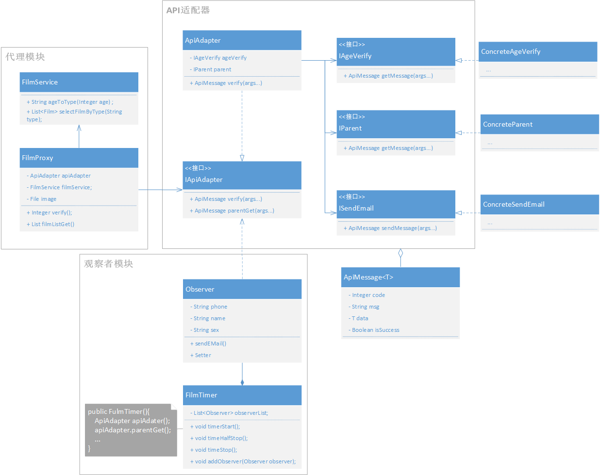

# 软件设计大作业

2020144131 20软件1 汪亦涵

[GitHub](https://github.com/say-code/filmSystem)

## 要求

现有客户需求完成一个影视播放APP，能够提供大量免费影视的移动播放功能，具体需求如下：

(1) 12岁以下儿童只能看动画片，并且观看影片名字和观看时长发给其监护人（如父母）；

(2) 13-18岁可观看所有影片，观看时长发给其监护人；

(3) 18岁以上无任何限制；

(4) 年龄等信息通过人脸识别完成；

(5) 监护人信息通过第三方接口完成，如户籍系统提供的接口等。

项目架构师分析认为，可通过代理模式、观察者模式、适配器模式联用完成相关设计，现请你：

（1）完成相关类图设计（类名采用相关英文单词）；

（2）完成相应代码并测试；

（3）年龄、影片类型可变动；

要求：设计具有可复用性、可扩展性。

## 设计思路

- 代理模式

  后端应当向用户隐藏数据库调用的相关服务，以及api调用的相关服务，防止用户越级控制数据库，出现安全隐患，同时为了减少前端请求次数，实现一次请求完成复数个服务，故利用代理统筹api和数据库服务，增强用户体验。

- 观察者模式

  要求中提到，18岁以下人群需要向家长发送信息，符合发布-订阅模式即观察者模式，故被观察者为电影事件（包含观影事件，影片名等属性），观察者为家长，当电影结束后，向家长发布通知

- 适配器模式

  要求中提到，系统中需要外部接口来提供人脸识别年龄、监护人户籍请求、信息发送等服务，显然是本系统难以做到的，故需要请求第三方接口，但由于第三方接口的不稳定性，导致可能会经常性的替换接口，对应的传输数据格式也会随之变换，此处采用数据库模式，防止接口的变换引起代码的修改。

  ​

## 类图




## 项目结构

```
-- filmSystem
 |-- adapter               适配器模块核心类
    |-- components             适配器组件
 |-- config                项目配置（年龄分级等）
 |-- controller            控制层 与前端交互
 |-- dao                   Dao层 控制数据库
 |-- mock                  Mock层 做假数据，充当假的api和数据库角色
 	|-- apiMock                充当api  
 	|-- dbMock                 充当数据库 
 |-- model                 模型层 存放bean
 |-- observe               观察者模块核心类
 |-- proxy                 代理模块核心类
 |-- service               服务层 集成Dao
 |-- test				  测试模块 存放测试类
```


## 整体流程

1. 用户希望看电影访问网站
2. 用户验证头像信息，输入身份证，前端将图片、身份证传给后端
3. 后端将图片提交给api，由api验证身份和年龄并返回给代理模块年龄信息
4. 代理模块根据年龄验证结果向数据库查找对应类型的影片，并返回给浏览器
5. 用户选择对应的影片，后端返回相应的影片数据并开始计时
6. 用户结束观影，倘若小于18岁，后端则会向api发起请求，请求父母的电话号码
7. 观察者模块增加父母观察者，并发布用户观影名及时长


## 快速启动

​	git项目后，通过maven安装相应模块。

​	启动后访问 http://127.0.0.1:8080

​	希望修改年龄请于filmSystem.mock.apiMock.AgeVerifyMock中进行